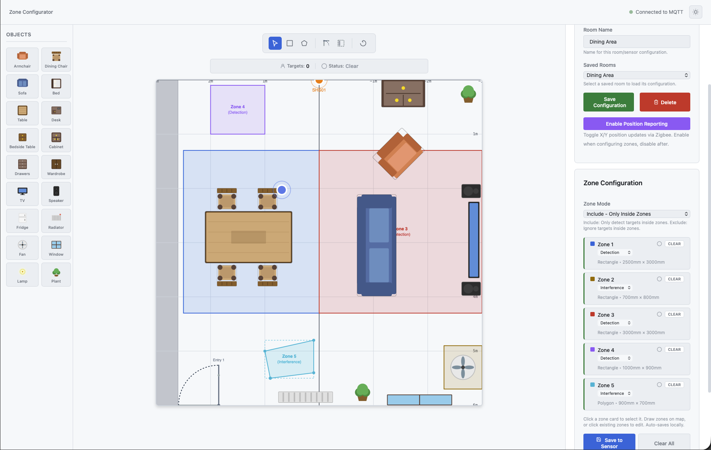

# SHS Z2M Presence Zone Configurator

**Home Assistant Add-on for Visual Zone Configuration of SHS01 mmWave Presence Sensors**



---

## Overview

This Home Assistant add-on provides a web-based interface for configuring detection zones on your [SHS Z2M Presence sensor](https://github.com/notownblues/SHS-Z2M-Presence). It connects directly to your Zigbee2MQTT broker via MQTT WebSocket and allows you to:

- Visualize real-time target positions on an interactive radar canvas
- Draw and configure up to 5 detection zones
- Place furniture and room objects on a virtual floor plan
- Save and load multiple room configurations
- Toggle position reporting mode directly from the UI

---

## Installation

### Step 1: Add the Repository

Add this repository to your Home Assistant Add-on Store:

1. Go to **Settings** → **Add-ons** → **Add-on Store**
2. Click the **⋮** menu (top right) → **Repositories**
3. Add the following URL:
   ```
   https://github.com/notownblues/SHS-Z2M-Presence-Zones
   ```
4. Click **Add** → **Close**

### Step 2: Install the Add-on

1. Find **SHS Z2M Presence Zone Configurator** in the add-on store
2. Click **Install**
3. Wait for the installation to complete

### Step 3: Configure MQTT Settings

> **⚠️ Important: You must configure your MQTT credentials before starting the add-on.**

1. Go to the add-on **Configuration** tab
2. Fill in your MQTT broker settings:

| Setting | Description | Default |
|---------|-------------|---------|
| `mqtt_host` | MQTT broker hostname | `homeassistant.local` |
| `mqtt_ws_port` | MQTT WebSocket port | `1884` |
| `mqtt_username` | MQTT username | (empty) |
| `mqtt_password` | MQTT password | (empty) |

**Note:** The add-on uses MQTT over WebSocket (not standard MQTT port 1883). Make sure your Mosquitto broker has WebSocket enabled on port 1884.

### Step 4: Start the Add-on

1. Click **Start**
2. Enable **Show in sidebar** for easy access
3. Click **Open Web UI** or access via the sidebar

---

## Docker Standalone Installation

  For users **not running Home Assistant OS/Supervised**

  ### Quick Start

  1. Clone the repository:
     ```bash
     git clone https://github.com/notownblues/SHS-Z2M-Presence-Zones.git
     cd SHS-Z2M-Presence-Zones/docker-standalone

  2. Edit docker-compose.yml with your MQTT broker settings:
     ```yaml
     environment:
       - MQTT_HOST=192.168.1.100    # Your MQTT broker IP
       - MQTT_WS_PORT=1884          # WebSocket port (not 1883!)
       - MQTT_USERNAME=             # Optional
       - MQTT_PASSWORD=             # Optional
     ```
  3. Start the container:
  docker compose up -d
  4. Access the web UI at: http://localhost:8099

  Requirements

  - Docker and Docker Compose
  - MQTT broker with WebSocket enabled (port 1884)
  - Zigbee2MQTT connected to your broker

  Note: See docker-standalone/README.md for detailed instructions, networking tips, and troubleshooting.

---

## How It Works

### Connecting to Your Sensor

1. Enter your sensor's Zigbee2MQTT topic in the **MQTT Topic** field (e.g., `zigbee2mqtt/SHS01`)
2. The connection status indicator will turn green when connected
3. Give your room a name and click **Save Configuration**

### Drawing Zones

The add-on supports up to **5 detection zones**. To create a zone:

1. Click on a **Zone Card** (Zone 1-5) in the right panel to select it
2. Click the **Rectangle** or **Polygon** tool in the toolbar
3. Draw the zone on the radar canvas
4. The zone coordinates are automatically saved

### Zone Types

Each zone can be configured as one of two types:

| Type | Behavior | Use Case |
|------|----------|----------|
| **Detection** | Only detect targets INSIDE this zone | Focus on specific areas like a bed, desk, or couch |
| **Interference** | Treat targets in this zone as false positives | Filter out reflections from windows, mirrors, or moving curtains |

### Zone Modes

The global **Zone Mode** determines how all zones work together:

| Mode | Behavior |
|------|----------|
| **Off** | All targets are detected regardless of zones |
| **Include** | Only detect targets that are INSIDE at least one zone |
| **Exclude** | Only detect targets that are OUTSIDE all zones |

### Saving Zones to Sensor

After drawing your zones, click **Save to Sensor** to send the configuration to your SHS01 sensor via Zigbee2MQTT. The zones are stored in the sensor's flash memory and persist across power cycles.

---

## Features

### Real-Time Target Visualization

When **Position Reporting** is enabled on the sensor, you'll see live target positions on the radar canvas:
- Up to 3 simultaneous targets
- Target distance and coordinates displayed
- Visual indicators for zone occupancy

### Furniture & Objects

Place furniture on your floor plan to visualize your room layout. Supported objects:

**Seating**
- Armchair, Dining Chair, Sofa, Bed

**Tables**
- Table, Desk, Bedside Table

**Storage**
- Cabinet, Drawers, Wardrobe

**Electronics**
- TV, Speaker

**Appliances**
- Fridge, Radiator, Fan

**Fixtures**
- Window, Lamp, Plant

### Room Tools

| Tool | Description |
|------|-------------|
| **Select** | Select and edit existing zones or objects |
| **Rectangle** | Draw rectangular zones |
| **Polygon** | Draw polygon zones (click to add points) |
| **Door/Entrance** | Mark room entrances |
| **Room Edge** | Grey out areas outside the room |
| **Rotate Map** | Rotate the entire map 90° |

### Position Reporting Toggle

The **Enable Position Reporting** button lets you toggle the sensor's Config Mode directly from the add-on. This is convenient for enabling real-time position data while configuring zones, then disabling it when done.

> 🚨 **Warning:** Position Reporting significantly increases Zigbee network traffic. Only enable it temporarily while configuring zones, then disable it immediately after. Prolonged use may cause network instability on busy Zigbee networks.

### Multiple Room Support

Save configurations for multiple rooms/sensors:
- Each room stores its MQTT topic, zones, and furniture placement
- Switch between rooms using the **Saved Rooms** dropdown
- Delete unused configurations with the **Delete** button

---

## Configuration Options

The add-on configuration is set in Home Assistant:

```yaml
mqtt_host: homeassistant.local
mqtt_ws_port: 1884
mqtt_username: ""
mqtt_password: ""
```

| Option | Required | Description |
|--------|----------|-------------|
| `mqtt_host` | Yes | Hostname or IP of your MQTT broker |
| `mqtt_ws_port` | Yes | WebSocket port (default: 1884) |
| `mqtt_username` | No | MQTT username (if authentication is enabled) |
| `mqtt_password` | No | MQTT password (if authentication is enabled) |

---

## Troubleshooting

### "Disconnected from MQTT"

- Verify your MQTT broker settings in the add-on configuration
- Ensure Mosquitto has WebSocket enabled on port 1884
- Check that your username/password are correct

### No Targets Showing

- Make sure **Position Reporting** is enabled on the sensor
- Verify the MQTT topic matches your sensor's Zigbee2MQTT friendly name
- Check that the sensor is paired and online in Zigbee2MQTT

### Zones Not Saving to Sensor

- Ensure you're connected to MQTT (green status indicator)
- Click **Save to Sensor** after drawing zones
- Check Zigbee2MQTT logs for any errors

---

## Related Projects

- **[SHS Z2M Presence Sensor Firmware](https://github.com/notownblues/SHS-Z2M-Presence)** — The ESP32-C6 firmware for the dual mmWave presence sensor
- **[Smart Home Scene DIY Guide](https://smarthomescene.com/guides/diy-zigbee-mmwave-presence-sensor-with-esp32-c6-and-ld2410/)** — Original project this is based on

---

## Contributing

Contributions are welcome! Feel free to:

- Report issues or bugs
- Submit feature requests
- Create pull requests with improvements

---

## Credits

This add-on is part of the SHS Z2M Presence project, built upon the excellent work from **[Smart Home Scene](https://smarthomescene.com)**.

